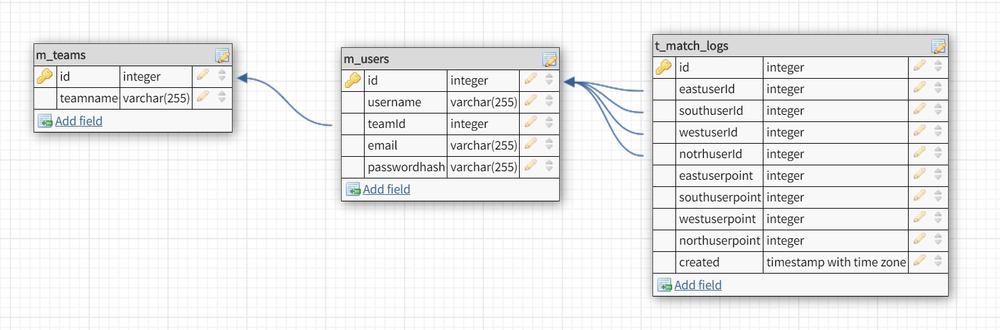

**このリポジトリは Code Chrysalis の生徒であるときに作成しました（This was created during my time as a student at Code Chrysalis）**

# M リーグ 2020 データに関する API サービス

このサービスは M リーグ 2020 データに関する API サービスを提供します。

また、自身の麻雀の成績を管理できます。

## 起動方法

1. 本プロジェクトを`git clone`します。
   ```
   $ git clone https://github.com/s1a2k1a3i/mahjong-log-app.git
   ```
2. 本プロジェクトに必要なパッケージをインストールします。
   ```
   $ yarn
   ```
3. DB の設定を行います。

   1. DB の ER 図は以下となっております。

      

   2. 使用する DB を追加します。
      ```
      $ psql -U <ユーザ名>
      パスワード
      > create database <DB名>
      ```
   3. `.env`ファイルに DB の設定を追加します。
      ```
      DB_NAME=<DB名>
      DB_USER=<ユーザー名>
      DB_PASSWORD=<パスワード>
      DB_HOST=localhost
      DB_PORT=5432
      ```
   4. 以下のコマンドで DB のマイグレーションを実行します。
      ```
      $ yarn migrate
      ```
      5 以下のコマンドで DB にデータ（11 月分）を入れます。auto_increment が 1 からになっていない場合はリセットしてください。
      ```
      $ yarn seed
      ```

4. 以下のコマンドで実行し、[http://localhost:3000](http://localhost:3000)で起動します。
   ```
   $ yarn start or yarn dev
   ```

## API 一覧

このアプリでは以下のエンドポイントを受け付けます。
|エンドポイント|HTTP メソッド|説明|
|-|-|-|
|`/api/users`|GET| ユーザーの一覧を返します。|
|`/api/users/:userId`|GET| 指定した ID のユーザー情報を返します。|
|`/api/users/team/:teamId`|GET| 指定したチームのユーザー情報を返します。|
|`/api/users`|POST|ユーザーを追加します。|
|`/api/users/:userId`|PATCH|指定した ID のユーザーの情報を変更します。|
|`/api/users/:userId`|DELETE|指定した ID のユーザーを削除します。|
|`/api/match-logs`|GET| 全ユーザーの戦績一覧を返します。|
|`/api/users/:userId/match-logs`|GET|指定した ID のユーザーの戦績一覧を返します。|
|`/api/users/:userId/match-logs/:matchId`|GET| 指定した ID ユーザーで、指定した ID のの戦績を返します。|
|`/api/match-logs`|POST| 指定した ID のユーザーの戦績を追加します。|
|`/api/match-logs/:id`|PATCH| 指定した ID ユーザーで、指定した ID のの戦績を変更します。|
|`/api/match-logs/:matchId`|DELETE| 指定した ID ユーザーで、指定した ID のの戦績を削除します。|
